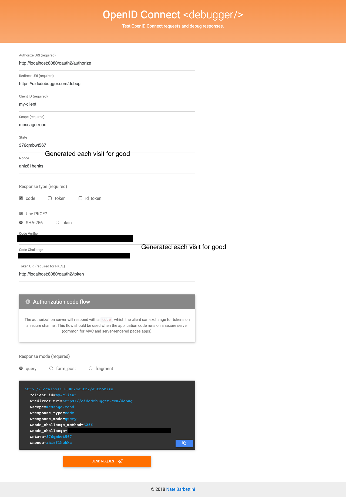
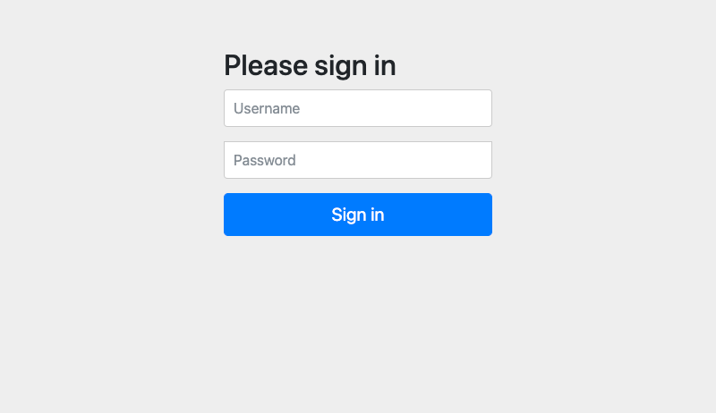

# Basic Spring Authorization Server Demo.

This is – in my opinion – the most minimalistic configuration of a spring authorization server which
can be used with the [OIDC Debugger](https://oidcdebugger.com).

All credentials are in memory and not really safe but this project is intended to allow a valid auth flow
to get a JWT. The description below states the required steps and shows the necessary config for the OIDC debugger.

The following text contains links to the Spring Docs with "current" as version. When reviewing it consider looking at the actual used versions from the pom.

## Auth procedure

<ol>
<li>Call of the authorize endpoint
    
  Can be done via the OIDC UI but basically generates a URI like
  <a href="http://localhost:8080/oauth2/authorize?response_type=code&client_id=my-client&scope=message.read&redirect_uri=http://127.0.0.1:8080/authorized&code_challenge=QYPAZ5NU8yvtlQ9erXrUYR-T5AGCjCF47vN-KsaI2A8&code_challenge_method=S256">
    http://localhost:8080/oauth2/authorize?response_type=code&client_id=my-client&scope=message.read&redirect_uri=http://127.0.0.1:8080/authorized&code_challenge=QYPAZ5NU8yvtlQ9erXrUYR-T5AGCjCF47vN-KsaI2A8&code_challenge_method=S256
  </a>
    
  Description of the parameters
  <dl>
      <dt><code>response_type</code></dt>
      <dd>Which kind of response is wanted? For the token we'd like to get a code with which we can retrieve the token.</dd>
      <dt><code>client_id</code></dt>
      <dd>
          The id of the client which will be looked up in the
          <a href="https://docs.spring.io/spring-authorization-server/docs/current/api/org/springframework/security/oauth2/server/authorization/client/RegisteredClientRepository.html">
          org.springframework.security.oauth2.server.authorization.client.RegisteredClientRepository
          </a>.</dd>
      <dt><code>scope</code></dt>
      <dd>
          For which scope is the permission required? Should be one of the scopes in the
          <a href="https://docs.spring.io/spring-authorization-server/docs/current/api/org/springframework/security/oauth2/server/authorization/client/RegisteredClient.html">
          org.springframework.security.oauth2.server.authorization.client.RegisteredClient
          </a>.
      </dd>
      <dt><code>redirect_uri</code></dt>
      <dd>
      Where should the request be redirected after the successful auth cycle? "localhost" requires the local loopback IP address!
      The redirect uri needs to be equivalent with the redirect uri in the registered client.
      </dd>
      <dt><code>code_challenge</code></dt>
      <dd>This is required for the "code" response_type to negotiate a secure exchange and will be used later on for token retrieval.</dd>
      <dt><code>code_challenge_method</code></dt>
      <dd>SHA-256 should be used in this case.</dd>
      <dt><code>state</code></dt>
      <dd>Not in this URI but working and generated with the oidc debugger. Used to trace a state on the backend during authorization.</dd>
      <dt><code>nonce</code></dt>
      <dd>Not in this URI but working and generated with the oidc debugger. Used to make attacks more complicated by generating an unique number.</dd>
  </dl>
</li>
<li>
    If not already logged in the spring default user credential page should appear. Here the credentials defined in the
    <a href="https://docs.spring.io/spring-security/site/docs/current/api/org/springframework/security/core/userdetails/UserDetailsService.html">
    org.springframework.security.core.userdetails.UserDetailsService
    </a> will be used.
</li>
<li>
    The grant should be given to the requested scope. Here the auth server displays a page which can approve this call. 
    This will be skipped when the <code>requireAuthorizationConsent</code> is disabled or commented in the
    <a href="https://docs.spring.io/spring-authorization-server/docs/current/api/org/springframework/security/oauth2/server/authorization/client/RegisteredClient.html">
    org.springframework.security.oauth2.server.authorization.client.RegisteredClient
    </a>.
</li>
<li>
    After the grant is given the redirect to the actual redirect url should occur. This application provides an endpoint
    <code>at.muli.demoauthserver.endpoint.AuthorizedEndpoint</code> which just reads the given parameters and provides a structured
    response. 
    Even if this endpoint is not listening, the code to request the token should be visible in the browser url bar as "code". 
    The OIDC debugger can be used in the meantime with the appropriate redirect URL
</li>
<li>
    When the redirect to the OIDC Debugger has been successful a result page should be visible and display the code.
</li>
<li>
    The Debugger should try to fetch the token and display it as well. This requires an additional CORS configuration seen in <code>BasicAuthServerConfiguration</code>.
</li>
<li>
    With the help of <a href="https://jwt.io">jwt.io</a> the <code>access_token</code> from the OIDC Debugger can be copied and pasted to display its contents.
</li>
</ol>

When using the OIDC Debugger online the URL needs to be registered in as redirect URL of the registered client.
The <a href="https://oidcdebugger.com">oidc debugger</a> could be used as well to debug the setup and generate urls. 
When using this debugger it must be entered as a redirect url!

To debug local response codes when any token generation goes wrong the properties <code>server.error.*</code> could
be set to display the error. <code>server.error.whitelabel.enabled</code> should stay <code>true</code>.

Created with the help of
<a href="https://www.javaadvent.com/2022/12/a-new-spring-security-authorization-server.html">JVM ADVENT</a>

## OIDC Debugger Settings

The request should use these parameters. Generated values are fine to be generated. There is no need to type them in.

After the request has been sent a redirect to the own application follows and asks for username and password.
Here the configuration from the <code>UserDetailsService</code> will be used. When there is already a user in the (local)
session this window will be skipped.

The successful roundtrip should result in a window like that

In the PKCE Result there is an <code>access_token</code> which can be copied to [JWT.io](https://jwt.io)

## Pitfalls

Which haven't been found in other tutorials so far (especially in combination with the OIDC Debugger).

- The scope can't be anything but must be a custom one which is present in the registered client
- Redirect URIs need to match exactly (feeling kind of stupid now for not have seen it)
- When the OIDC Debugger should read the token the CORS setting of the own application needs to allow it

## Acknowledgements

- [JVM ADVENT](https://www.javaadvent.com/2022/12/a-new-spring-security-authorization-server.html) for the detailed explanation
- [Spring](https://spring.io) for providing and maintaining this piece of software
- The [OIDC Debugger](https://oidcdebugger.com) which makes it easy to generate a token
- [JWT.io](https://jwt.io) which provides an easy way of inspecting the generated token on the clientside without any server request 
